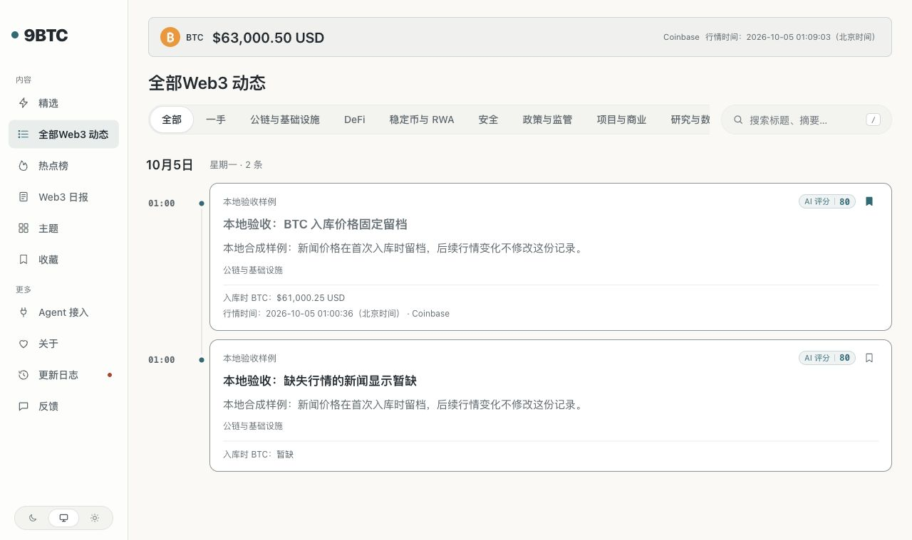
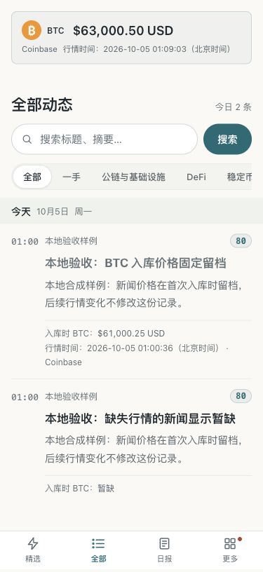
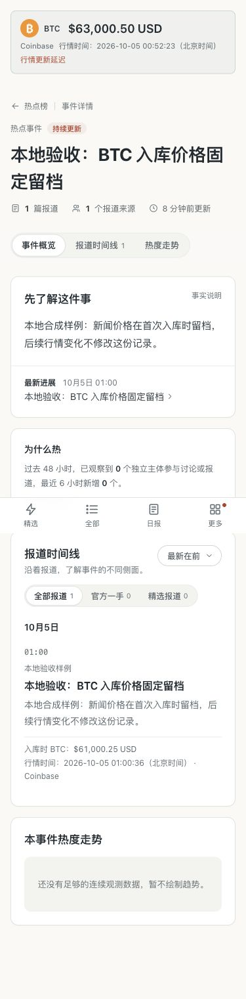

# BTC 美元行情本地验收

日期：2026-10-05。范围：本地实现、隔离数据库验证与一次真实 Coinbase 采集试跑。生产环境尚未发布或迁移。

## 已实现的行为

- 后台使用 Coinbase Exchange 的固定 `BTC-USD/ticker` 地址，每 5 分钟采集一次；遵守 `COLLECT_ENABLED` 开关及已有出站网络限制。10 秒超时，最多 16 KiB，不跟随重定向。
- 验证价格为正且有限、成交 ID 安全、交易时间有效，拒绝超过 5 分钟或超前超过 5 秒的行情。失败不写入新记录，保留已有行情。
- 新行情追加保存。所有采集、导入和外部上报经过同一入库入口：首次插入新闻时，使用数据库真实墙钟时间，原子绑定当时最近且不超过 5 分钟的行情。交易与获取时间必须均不晚于入库时间。
- 重复发现、内容修订和并发入库不改变原始行情引用。没有有效行情时永久为空；历史新闻不以当前价补填。
- 全局顶部显示美元行情、Coinbase 来源和北京时间。浏览器只访问本站接口，打开后立即刷新，每 10 分钟刷新；隐藏暂停，恢复立即刷新，卸载取消请求，过时响应不能覆盖新响应。
- 请求失败或报价、获取时间任一超过 15 分钟时显示“行情更新延迟”。页面时钟独立更新状态，不增加价格请求频率。服务端初始时间随 loader 数据传递，避免缓存 HTML 跨越门槛后的 hydration 结构差异。
- 新闻主列表、详情、事件时间线、展开报道、事件后续和收藏卡片显示固定入库价格，缺失显示“暂缺”。收藏保存公开数据的快照，导入时校验，旧收藏保持缺失。
- 行情接口 `/api/site/market/btc` 只读数据库，返回 `no-store`。新闻仍通过 publication 层，公开资格条件未改变。

## 验证结果

| 检查 | 已验证结果 |
| --- | --- |
| 空库迁移 | 47 个迁移成功，含 `0050_btc_usd_quotes.sql` |
| 类型检查 | 通过 |
| 完整后端回归（与原项目最新提交组合） | 512 / 512 通过；功能原基线另有 470 / 470 通过记录 |
| 网页测试 | 28 / 28 通过，含 15 分钟门槛跨越时的实际组件初始 HTML 一致性检查 |
| 网页构建 | 通过 |
| 本地全站检查 | 15 个页面、14 个机器出口、MCP 初始化，共 30 项通过 |
| 浏览器 | 1440 / 1280 桌面和 375 手机宽度检查，未出现横向页面溢出 |
| 展示 | 当前合成行情 `$63,000.50 USD`，既有新闻固定 `$61,000.25 USD`，无行情新闻“暂缺”；详情、事件时间线、收藏均可见固定记录 |
| 缺失与过期 | 初始无行情显示“行情暂不可用”；故意过期的合成行情显示延迟提示 |
| 浏览器日志 | 重启最终构建后的新页面未记录 warning / error |
| 独立复核 | 规格及最终质量复核通过；初始时钟问题已修复，后续报道展示也已补齐 |

测试使用本任务专用的临时 PostgreSQL 数据库；外部模型和推送由测试替身或关闭开关隔离。测试可写入隔离数据，未使用生产数据库。全套回归必须使用新库：重复测试会留下其他已有测试的共享额度状态。

## Coinbase 实际链路试跑

使用实际 `collectBtcUsdQuote()` 和已有受限出站采集器，仅对 Coinbase 公共接口进行一次读取，并将结果写入隔离验收库：

- 价格：`85362.94 USD`
- 行情时间：`2026-10-04T17:00:35.550Z`，北京时间 `2026-10-05 01:00:35`
- 本站获取时间：`2026-10-04T17:00:36.888Z`
- 来源：Coinbase；结果通过校验并成功入库。

上述是试跑时的记录，不能当作阅读本文时的最新价格。页面截图使用明确标注的合成新闻和合成价格，用于验证留档关系，不是真实新闻或市场价格。

## 交付与边界

功能提交 `6dcdd60` 在隔离工作目录完成，与原项目新增提交 `bcb1556` 合并后，组合版本 `8b08143` 通过类型检查、构建、512 项后端回归和 28 项网页测试。已快进合回原项目 `feat/9btc-web3` 分支，并从原目录再次通过类型检查、构建及 30 项全站检查。合入后再次核对既有未提交文件的 SHA-256，未发现内容变化；原有 49 个未提交路径继续保留。本任务临时工作目录、分支、浏览器预览及测试服务已清理。

真实生产服务器的 Coinbase 连通性、定时任务连续运行、数据库迁移及公网展示尚未验收。手机宽度检查属于桌面浏览器中的响应式验收，不代表 iPhone、Android 或微信真机。

## 页面证据

